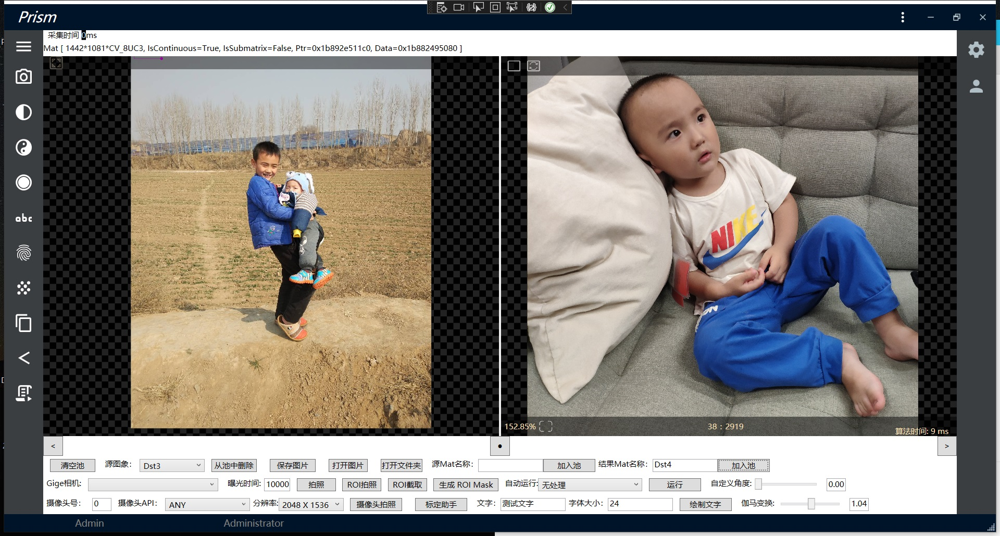

## 简单介绍：
看这篇博客快速了解：
https://blog.csdn.net/tfarcraw/article/details/108028209?spm=1001.2014.3001.5501
 ,
 

目标框架：.NET5.0

使用到的开源组件：
 
OpenCvSharp  https://github.com/shimat/opencvsharp

Prism    https://prismlibrary.com/

Material Design In XAML Toolkit   http://www.materialdesigninxaml.net/   

Newtonsoft Json.NET  http://www.materialdesigninxaml.net/

NLog  https://nlog-project.org/?r=redirect

交流QQ群：827888895

###  推荐关注另一个opencvsharp开源项目：https://gitee.com/lolo77/OpenCVVision，
###  这个项目演示了3D结构光，光度立体法等一些酷炫的应用，非常棒！

## 更新日志：
2020.08.27：

1、调整程序框架；

2、不再集成相机运行时，如果需要请另行下载，下载后解压至D:\OpenCV\Runtimes目录下：
：

海康SDK（如果已经安装MVS就不需要下载）:
链接：https://pan.baidu.com/s/1BZ_flwm3OjcG6-5XpflzTw 
提取码：yiji

Basler:（如果已经安装pylon就不需要下载）：
链接：https://pan.baidu.com/s/1VkwENHA7wusdosoKpaFpBw 
提取码：yiji 

2020.08.29 整理opnecvcli分支，加入zbar（X64)条码解码

opnecvcli分支演示了把opencv包装成c++/clr的方法，实现opencv和opencvsharp直接传Mat，使调用原生opencv时更加灵活。

这个分支目前演示了以下功能：

微信二维码  https://mp.weixin.qq.com/s/pphBiEX099ZkDV0hWwnbhw

条码识别 https://mp.weixin.qq.com/s/odrdAlfAOmNfYitRJ-k6uQ

计划加入：

PaddleOCR
https://blog.csdn.net/tfarcraw/article/details/117902521?spm=1001.2014.3001.5501

在我的博客中有介绍：
https://blog.csdn.net/tfarcraw/article/details/115561759?spm=1001.2014.3001.5501

opnecvcli分支不免费开源，为本项目贡献代码或捐助本项目后可获得源码。如有需要请联系QQ:123211521 微信17551023102

,