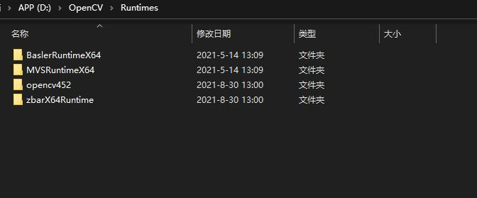

## 简单介绍：
看这篇博客快速了解：
https://blog.csdn.net/tfarcraw/article/details/108028209?spm=1001.2014.3001.5501
 
 

目标框架：.NET5.0

使用到的开源组件：
 
OpenCvSharp  https://github.com/shimat/opencvsharp

Prism    https://prismlibrary.com/     一个非常易用的框架， 帮助我们方便地实现松耦合

Natasha  https://github.com/dotnetcore/Natasha 基于 Roslyn 的 C# 动态程序集构建库，让程序拥有强大的脚本功能

Material Design In XAML Toolkit   http://www.materialdesigninxaml.net/   

Newtonsoft Json.NET  http://www.materialdesigninxaml.net/

NLog  https://nlog-project.org/?r=redirect 

交流QQ群：827888895  进群暗号：shimat

###  推荐关注另一个opencvsharp开源项目：[OpenCVVision](https://gitee.com/lolo77/OpenCVVision) 这个项目演示了3D结构光，光度立体法等一些酷炫的应用，非常棒！

## 使用说明
不再集成相机运行时，如果需要请另行下载，下载后放到 D:\opencv\runtimes目录，然后解压到各自以压缩包为名的目录

,

海康SDK（如果已经安装MVS就不需要下载）:

链接：https://pan.baidu.com/s/1BZ_flwm3OjcG6-5XpflzTw 
提取码：yiji

Basler:（如果已经安装pylon就不需要下载）：

链接：https://pan.baidu.com/s/1VkwENHA7wusdosoKpaFpBw 
提取码：yiji

## opnecvcli分支

opnecvcli分支演示了把opencv包装成c++/cli的方法，实现opencv和opencvsharp直接传Mat，使在C#中调用原生opencv时更加灵活。

在我的博客中有介绍：

https://blog.csdn.net/tfarcraw/article/details/115561759?spm=1001.2014.3001.5501

opencv 4.5.2运行时(也可以自己编译）：

链接：https://pan.baidu.com/s/1TQnZJrvFYk8AqoDgZFRBaA 
提取码：yiji

zbarX64运行时:

PaddleOCR
https://blog.csdn.net/tfarcraw/article/details/117902521?spm=1001.2014.3001.5501

libdmtx Datamatrix解码

